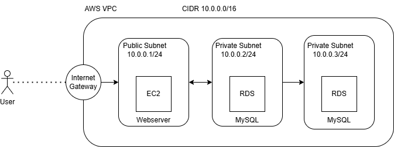
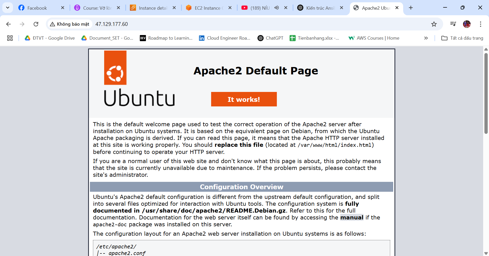
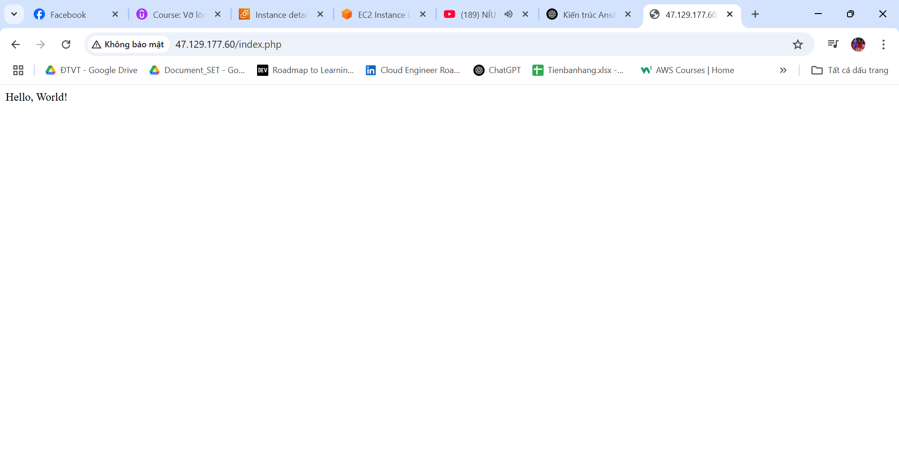
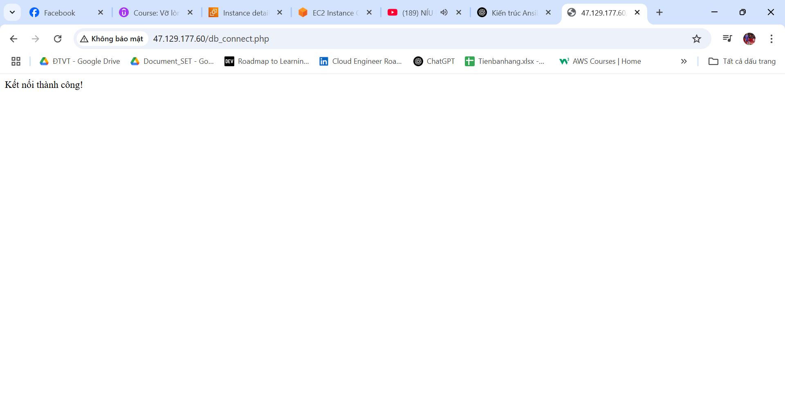

# Deployment Steps for EC2 and RDS on AWS Dashboard



## 1. Configure Networking
- Set up **VPC** (Virtual Private Cloud).
- Create an **Internet Gateway** and attach it to the VPC.
- Define **Public and Private Subnets**.
- Configure **Route Tables** for both subnets:
  - Associate the public subnet with the **Internet Gateway**.
  - Associate the private subnet with a **NAT Gateway** (if outbound internet access is needed).

## 2. Set Up Security Groups
- Create **Security Groups** for both the **EC2** and **RDS** instances.
- Configure **inbound and outbound rules**:
  - Allow **SSH (22)**, **HTTP (80)**, and **HTTPS (443)** for the EC2 instance.
  - Allow **MySQL/Aurora (3306)** for the RDS instance, accessible only from the EC2 security group.

## 3. Launch an EC2 Instance
- Deploy an **EC2 instance** using an Ubuntu AMI.
- Associate it with the **public subnet**.
- Attach the previously created **Security Group**.
- Connect to the instance via **SSH** and install necessary software:

  ```bash
  sudo apt update
  sudo apt install -y apache2 php php-mysql
  sudo systemctl enable apache2
  sudo systemctl start apache2
  ```

## 4. Deploy an RDS Database
- Create an **RDS instance** in the **private subnet**.
- Choose **MySQL** (or another database engine) and configure:
  - Select the **private subnet** for security.
  - Ensure the **RDS Security Group** allows connections from the EC2 instance.
  - Retrieve the **RDS endpoint** from the AWS console after creation.

## 5. Connect EC2 to RDS
- Update your web application’s database connection settings:

  ```php
    <?php
    $servername = ""; // Thay bằng địa chỉ server của bạn nếu khác
    $username = ""; // Thay bằng username MySQL
    $password = ""; // Thay bằng mật khẩu MySQL nếu có
    
    // Tạo kết nối
    $conn = new mysqli($servername, $username, $password);
    
    // Kiểm tra kết nối
    if ($conn->connect_error) {
        die("Kết nối thất bại: " . $conn->connect_error);
    } else {
        echo "Kết nối thành công!";
    }
    
    // Đóng kết nối
    $conn->close();
    ?>
  ```

## 6. Access the Web Server
- Retrieve the **Public IP** of your EC2 instance.
- Open a browser and access the web server:
  ```
  http://your-public-ip
  ```

This setup ensures that your EC2 instance communicates securely with the RDS instance while keeping the database in a private subnet for security. 🚀

## 7. Result



