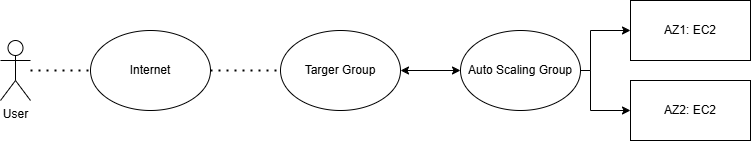

# AWS Load Balancing Demo

## Overview
This guide demonstrates how to set up load balancing on AWS using EC2 Auto Scaling Groups and a Load Balancer. The process includes creating an EC2 launch template, configuring an auto-scaling group, and setting up monitoring with CloudWatch.

## Steps

### 1. Create an EC2 Launch Template
To ensure newly launched instances are correctly configured, add the following User Data script:

```bash
#!/bin/bash
sudo yum update -y
sudo yum install httpd -y
sudo systemctl start httpd
sudo systemctl enable httpd
echo "<h1> We're on the $(hostname)</h1>" | sudo tee /var/www/html/index.html
```

This script updates the system, installs and starts the Apache web server, and creates a simple index.html page displaying the instance hostname.

### 2. Create a Target Group
- Navigate to the **AWS EC2 Console** → **Target Groups**.
- Create a new target group for the load balancer.
- Select **Instance** as the target type.
- Specify the health check settings (e.g., HTTP protocol on port 80).
- Register existing EC2 instances if applicable.

### 3. Create an Auto Scaling Group
- Navigate to **AWS EC2 Console** → **Auto Scaling Groups**.
- Click **Create Auto Scaling Group**.
- Choose the **Launch Template** created in Step 1.
- Attach the **Target Group** created in Step 2.
- Define scaling policies and instance limits.
- Set up notifications if needed.

### 4. Configure Load Balancer
- Navigate to **AWS EC2 Console** → **Load Balancers**.
- Click **Create Load Balancer**.
- Choose **Application Load Balancer (ALB)**.
- Configure listeners for HTTP traffic on port 80.
- Attach the **Target Group** from Step 2.
- Configure security settings and ensure that inbound rules allow HTTP traffic.

### 5. Monitor with CloudWatch and Set Alerts
- Navigate to **AWS CloudWatch Console**.
- Set up **metrics and alarms** to monitor instance performance.
- Create alerts for CPU utilization, request counts, and instance health.
- Define auto-scaling policies based on the CloudWatch metrics.

### 6. Verify Scaling and Load Balancing
- Access the Load Balancer DNS name in a browser.
- Refresh multiple times to observe different instance hostnames, confirming load balancing.
- Test auto-scaling by generating traffic or adjusting CPU load.
- Monitor new instances launching and old instances terminating as per the scaling policy.

## Conclusion
By following these steps, you can effectively implement AWS load balancing using Auto Scaling Groups and a Load Balancer. This setup ensures high availability and scalability for web applications.

